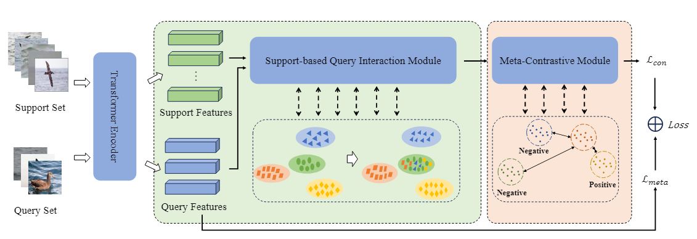
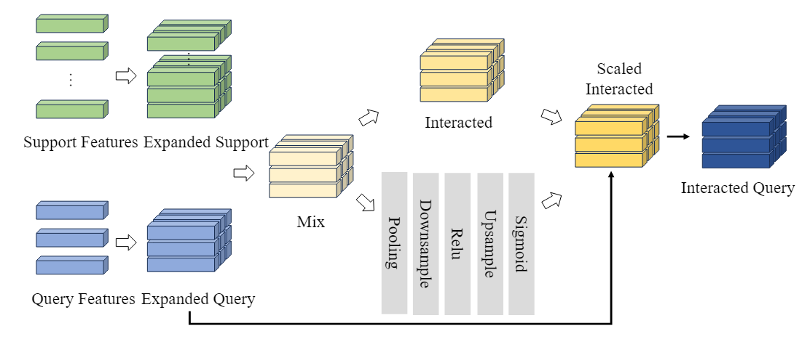
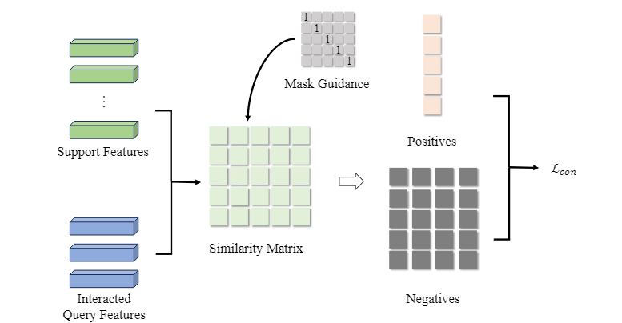
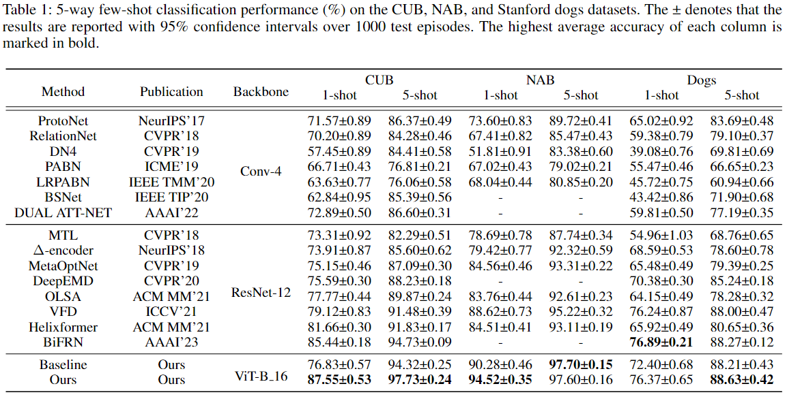

# Meta-contrastive Learning with Support-based Query Interaction for Few-shot Fine-grained Visual Classification

> Few-shot fine-grained visual classification combines the challenge of scarcity of training data for few-shot tasks and intrinsic property with inter-intra variance for fine-grained tasks. To alleviate this problem, we first propose a support-based query interaction module and a meta-contrastive method. Extensive experiments demonstrate that our method performs well on both common fine-grained datasets and few-shot datasets in different experimental settings.

# Our Major Contributions

> 1. We propose a novel meta-contrastive framework for finegrained few-shot learning, further improving the performance of few-shot learning and fine-grained tasks. This may be the first to apply contrastive learning to finegrained few-shot tasks.
> 2. We develop a support-based query interaction method that not only establishes the dependencies between support samples and query samples, but also enhances query features by leveraging support features.
> 3. We conduct comprehensive experiments on three benchmark fine-grained datasets and a common few-shot benchmark dataset. Our experimental results achieve a SOTA performance on these datasets.

# Architecture of our proposed Network



> The network is composed of three main parts, including the feature extractor module, the support-based query interaction module (SQIM), and the meta-contrastive module (MCM). Among them, SQIM and MCM are the core of the proposed method. Indeed, SQIM mines latent knowledge by interacting with query features and support features. MCM enhances the model's learning ability to perform fine-grained few-shot tasks by incorporating the concept of contrastive learning.

# Support-based Query Interaction Module



> The detailed flow of support-based query interaction module.

# Meta-Contrastive Module



> The detailed flow of meta-contrastive module.

# Configuration Environment

> Clone this repository, and build it with the following command.

``````
conda create --name newEnv python=3.8 -y
conda activate newEnv
conda install pytorch torchvision torchaudio cudatoolkit=11.3 -c pytorch
......
``````


#  Result



> 5-way few-shot classification performance (%) on the CUB, NAB, and Stanford dogs datasets. The ± denotes that the results are reported with 95% confidence intervals over 1000 test episodes. The highest average accuracy of each column is marked in bold.

